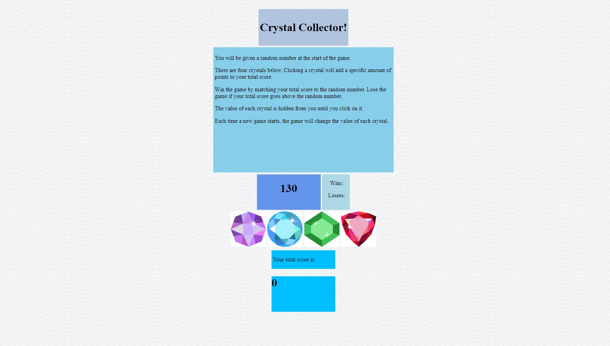

# Crystal Collector

Interactive web browser game built for the Georgia Tech Full-Stack Web Development Bootcamp.

### Technologies Used

- HTML
- CSS
- JavaScript/jQuery

### Game Overview

   * There will be four crystals displayed as buttons on the page, each with a random hidden value between 1 - 12.

   * The player will be shown a random number at the start of the game.

   * When the player clicks on a crystal, it will add a specific amount of points to the player's total score. 

     * The game will hide this amount until the player clicks a crystal.
     * When a crystal is clicked, the player's score counter is updated.

   * The player wins if their total score matches the random number from the beginning of the game.

   * The player loses if their score goes above the random number.

   * The game restarts whenever the player wins or loses.

     * When the game begins again, the player will see a new random number. Also, all the crystals will have four new hidden values and the user's score (and score counter) will reset to zero.

   * The app shows the number of games the player wins and loses.

### Links

-[Repo](https://fyeh0.github.io/unit-4-game/)
-[Github](https://github.com/fyeh0)